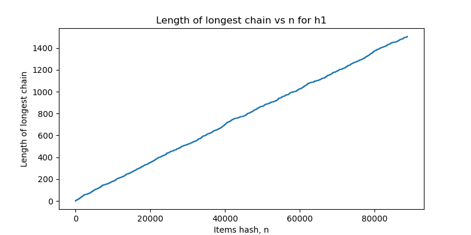

### First hash function


### Second hash function


ℓ is the # of buckets in the hash table

## Ai Values:
```
 [5233, 8129, 9927, 6160, 2003, 8521, 8877, 3752, 8587, 9240, 6972, 6139, 7897]
```

## ℓ = 5851

### Distribution of hash locations (Histogram)


### Length of the longest chain



### Number of collisions as function of ℓ


